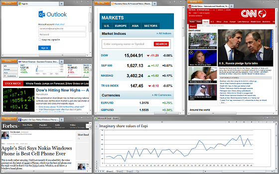
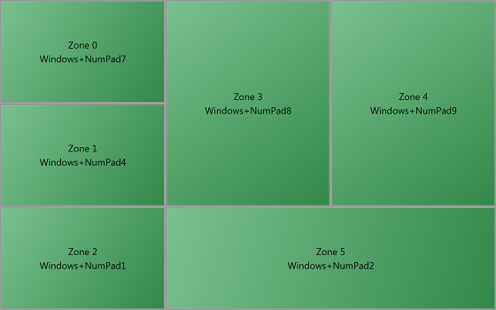
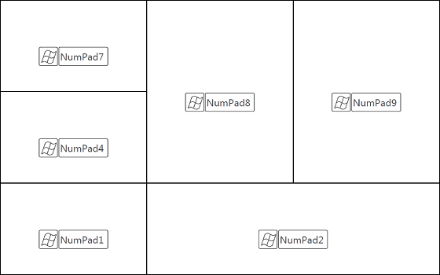

# DesktopManager

## Description

Big high-resolution computer screens, we love them! Even better is to have at least two of those connected at the same time. Given the current prices such a setup has become more and more mainstream in both home and office users.

The expected gain in productivity is however not always reached because our operation system is not designed to make full use of this huge amount of pixels. Expi Desktop Manager offers a solution to manage how your different applications running are placed on the desktop. It gives you the ability to create different zones on your desktop and assign a hotkey to each one of them. This way you always have a clean looking (and probably very productive!) desktop, without spending time on dragging and resizing windows.

There are different ways to create the zones, including templates. Furthermore there is no limit on the number of screens you can access, nor on the number of zones you can create.

Each configuration of zones with their hotkeys is saved as a profile, and you can easily switch between those. This is especially interesting for laptop users who use different setups, like with an extra screen attached when you're at work, without one if you're sitting in the couch, and with a big television attached when you want to watch a movie.

Once you've set up a profile, you can start enjoying all features without having to look at the program again, as it works in the background without bothering you.

## Help

### Getting started

Once you have installed Desktop Manager and run it you will see each of your connected screens represented as a blue rectangle. If you're not happy with that configuration, you can change it using "Edit -> Change screens". This will bring up the default Windows page for screen setup. Alternatively you might want to use the software that came with your graphics card (Nvidia, Amd, Intel,...) to do this. Any changes you make will be visible in Desktop Manager immediately.

If the area of the screens is too big to be represented you can use the scroll bars or the zoom button which can be found on the right bottom (where the scroll bars come together).

### Adding zones
Right click on one of the screens, or choose "Edit -> Create multiple zones". Select which screen you want to divide into different zones. If, for example, you want two rows with each three columns of zones, then choose Horizontal = 3 and Vertical = 2. Alternatively you can choose from one of the templates. The zones you have created now do not have hotkeys assigned yet. This will be shown in the next step.

### Adding or editing a single zone

To edit an existing zone, left-click on the green rectangle, or double click on the name of the zone in the list on the right. To quickly remove a zone, right-click on the green rectangle.
To add a new zone, left click on one of the screens, or choose "Edit -> Create one zone". The window that will show up gives you the possibility to choose a name for your new zone, a hotkey, and the area where you want your zone to be.

For the hotkey, you need to choose at least one of either "Alt", "Ctrl", "Shift" or "Windows" (the Winkey on your keyboard), and one "Key" which can be basically anything. For the area, you'll have to keep in mind that the top left pixel of your primary screen (that's the one with your taskbar) is the point X = 0, Y = 0. Press "Ok", and you'll see a green rectangle which represents the zone. 
If you did select a usable hotkey, click on any open window on your desktop and hit your new hotkey. You will see the window jump to that location.

### Which hotkey should I use?

That's basically up to you; however there are a few things you need to keep in mind. First of all don't use a hotkey that you already use for other goals as it will overwrite the current function. Secondly, not all key combinations will work. For example if you try Alt+Ctrl+Del, you'll get an error message. I assume you're experienced enough with Windows to know that's a good thing! Sometimes it will however not be clear why a certain combination won't work. 
Of course it might be difficult to remember all your new hotkeys. Using "File -> Save keyboard map" however you can save a graphical representation of all your zones and their corresponding hotkeys. The standard option is as a .pdf file, but you can also save it in different kinds of graphical formats. If you have overlapping zones, the keyboard map will show the top layer. If you need to see another layer on your keyboard map, then change the visual order by clicking on other zones in the list. In case you use one of the graphical formats, screen names and zone names/hotkeys will be shown according to your options at that moment.

### Your profile in use

Don't forget to save your profile. A default directory therefore is made in your documents. Of course you can put your profiles in a different directory, but using the default one makes them quickly accessible from the tray. If you click on the minimize button you will notice that Desktop Manager disappears. It actually will run on the background, and if you need to change something you can access it in from the tray (that's the right of your taskbar). From the tray you can not only access Desktop Manager, but also quickly switch between all profiles saved in the default directory.

If you have selected "Options -> Run when Windows starts", then Desktop Manager will start up minimized and automatically load your last used profile. So you won't notice anything, except for the fact that all your hotkeys work of course.

### Does it work on all programs?

There are a few exceptions. Full screen games might try to get back to their full screen state. Some games we tested however behaved well, which made it possible to play two instances of the game simultaneously on the same screen (not very practical though).
Some programs have a minimum size. If you send them to a zone smaller than the minimum size, it will not fit in completely. These minimum sizes are in general the actual minimum to have some use of the program, so you might want to send it to a bigger zone anyway. 
Finally, some programs, like the Windows Calculator, have a fixed size. When you send such a program to a zone, the location of the left top corner will be correct, but the program won't resize because it's not meant to do so.

## Directories in this repository:

- scr: The source code. The program is written in C#.
- img: Some images used in the description
- setup: Contains a setup with the compiled program . If you just want to use the program and are not interested in the source then this is what you're after (the file setup.exe).
